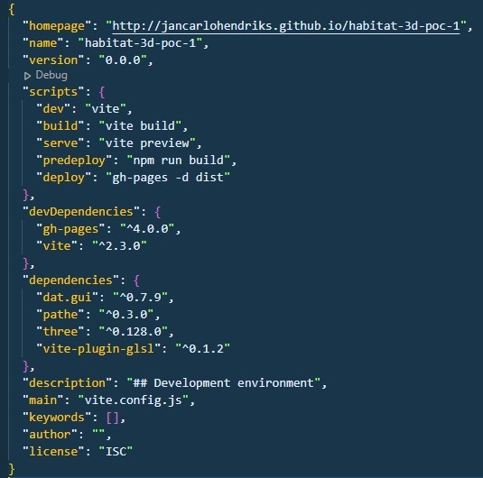
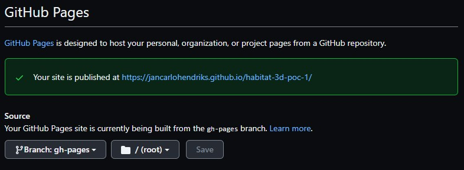

# Habitat 3D POC - bringing 3D to the web

## Contents
- [The goal](#the-goal)
- [How it works](#how-it-works)
- [Demos](#demos)

## The goal
This proof of concept was built for demonstrating the use of Three.js and add interactivity to a 3D model built on my own, simulating the same experience as seen in one of the websites I got inspired from: [Magical Reflections: a virtual art experience](https://www.magische-spiegelungen.de/).

## How it works
This proof of concept works with an imported glTF file, which contains the whole 3D scene and its corresponding objects, animations, etc...

In order to import a 3D scene you will need to use GLTFLoader and a local copy of your glTF export (file format generated is .glb).
```js
const loader = new GLTFLoader()
loader.load(
	"/models/[MODEL_NAME].glb",
	function (gltf) {
		/* ... play with the 3D objects in here */
	},
	(xhr) => /* handle load */,
	(error) => /* handle error */
)
```

You can import GLTFLoader directly from Three.js
```js
import { GLTFLoader } from 'three/examples/jsm/loaders/GLTFLoader'
```

If you want to interact with a 3D object you can iterate through the children and find it by name or any other parameter you would like.
```js
gltf.scene.children.find(x => x.name == "NAME OF OBJECT TO BE INTERACTED WITH")
```

For animations, Three.js comes with an AnimationMixer configuration which takes control of your exported animation.
```js
const clip = THREE.AnimationClip.findByName( gltf.animations, 'NAME OF THE ANIMATION' )
const mixer = new THREE.AnimationMixer(/* INSERT OBJECT THAT HAS ANIMATION EG. gltf.cameras[0] */)
const action = mixer.clipAction(clip)
action.play()
```

If you want to use the scroll event for interacting with your animation, you will need to create a function first to control a global variable.

In this case:

```js
var animationScroll = 0;
```

```js
function onScroll(e) {
	if (animationScroll > 0.1 && e.deltaY < 0) animationScroll = animationScroll - 0.1
	if (animationScroll < 4.1 && e.deltaY > 0) animationScroll = animationScroll + 0.1
}
window.addEventListener('wheel', onScroll, false)
```

In order for the 3D scene and animation to work, you need to refresh every frame. The requestAnimationFrame looping function is exactly meant for this use case, since it takes into consideration your computer's frame rate, making this process a lot more optimized.

```js
function animate() {
	requestAnimationFrame(animate)
	if (mixer) mixer.setTime(animationScroll)
	if (camera) renderer.render(scene, camera)
	stats.update()
}
animate()
```

## Demos

Working prototype page: https://jancarlohendriks.github.io/habitat-3d-poc-1/

You can scroll up or down in order to control the animation.


### YouTube videos
#### [Blender animation test](https://www.youtube.com/watch?v=tyoUzYoNWDQ)
[](https://www.youtube.com/watch?v=tyoUzYoNWDQ "Blender animation test")

#### [Three JS test](https://www.youtube.com/watch?v=n1ApTcDTFVk)
[](https://www.youtube.com/watch?v=n1ApTcDTFVk "Three JS test")

## Management and Control

### Configuration, change and release management


### Build and test infrastructure
